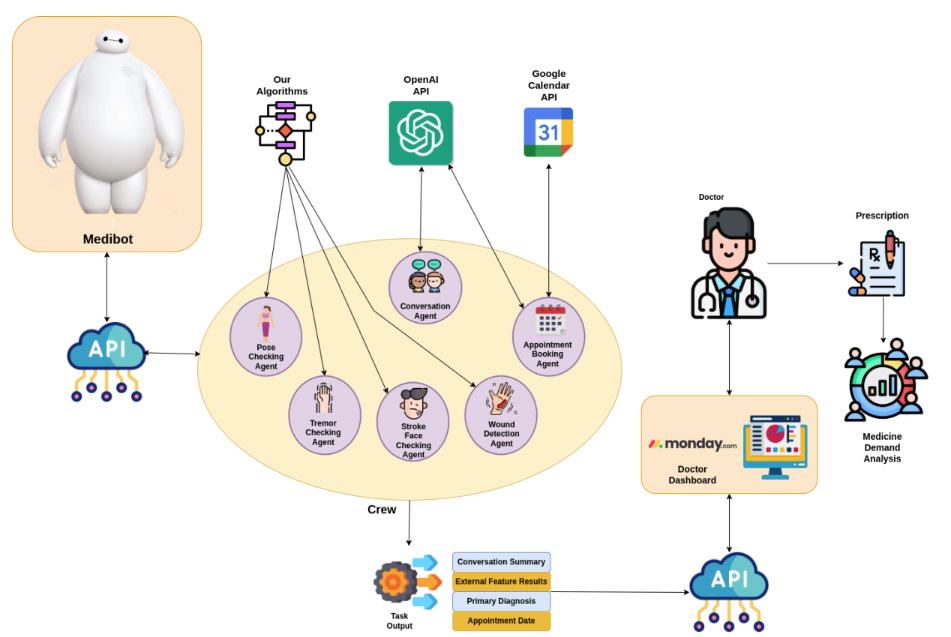

# Md Iftekher Hossain

**Doctoral Researcher** @ **[Cognitive Robotics Group](https://research.tuni.fi/cogrob/), Tampere University**  | ✉️ [iftekher.hossain21@gmail.com](mailto:iftekher.hossain21@gmail.com) | 

---

## 👋 About Me
I am a Doctoral Researcher in Robotics focusing on generalist robotic policy learning with spatial understanding. My research aims to develop data-efficient learning methods that enable robotic systems to generalize across tasks and environments, with a strong emphasis on real-world industrial deployment. I am currently a researcher in the PERFORM project within the Cognitive Robotics Group at Tampere University. My journey in intelligent robotic manipulation began during my Master’s thesis at the Intelligent Robotics Group, Aalto University, where I worked on zero-shot robotic policy learning using large language and vision–language models. This experience shaped my research focus on data-efficient, generalizable robotic systems for real-world deployment.

---
## 💼 Professional Experience

### Research Assistant (Summer Intern)  
**Intelligent Robotics Group, Aalto University**  
*June 2025 – Present*

- Systematically evaluated **foundation-model-based zero-shot imitation learning** across **six task families**.
- Performed **sim-to-real transfer** of zero-shot manipulation on a real **Franka Emika Panda** robot.
- Conducted **ablation studies** to improve video understanding and foundation-model-based manipulation performance.
- Implemented **MoveIt Task Constructor** with the **Franka Emika Panda** robot in simulation.

### Master’s Thesis Worker  
**Intelligent Robotics Group, Aalto University**  
*[Thesis](https://jyx.jyu.fi/jyx/Record/jyx_123456789_102764?sid=169128622)*  
*January 2025 – May 2025*

- Enhanced **zero-shot trajectory generation** using **LLM-based reasoning**.
- Introduced **OAG** and **SOAG** for transferring **passive human demonstration knowledge** to robotic execution in novel environments.
- Integrated **audio transcription**, improving **OAG task recognition by 60%**.
- Achieved **75% success** on **contact-rich manipulation tasks** (pushing, pulling, reaching) over **12 execution phases**.
- Developed a **fully prompt-based imitation learning system** requiring **no robot-specific training data**.
- Designed a framework for **trajectory generation from passive video demonstrations** using **LLM reasoning** and **semantic abstraction**.
- Leveraged **vision–language models** for **zero-shot action sequence extraction** and **high-level planning**.
- Implemented **object detection, tracking, and semantic mapping** in **PyBullet** using the **Franka Emika Panda** robot.
- Evaluated **domain shift effects** and devised robust **task generalization techniques** using **SOAG abstraction**.
- **Awarded Grade:** **5/5 (Excellent)**

### Data Scientist  
**SSL Wireless**  
*November 2021 – August 2023*

- Developed and deployed **computer vision systems**, including image segmentation for shop detection and size estimation, and object detection for variable-sized **FMCG products**.
- Integrated production systems using **FastAPI** and **Docker**, ensuring scalability and reliability.
- Improved **national ID verification accuracy to 98.5%**.
- Introduced a **Mean Embeddings** approach for multi-face recognition, increasing accuracy by **8%** and reducing inference time by **5×**.
- Built automated **large-scale data scraping pipelines** for social media analytics.
- Developed methods for **shop image verification** and **automated invoice data parsing**.
- Applied **time-series forecasting** to daily service usage data and implemented predictive strategies.
- Mentored junior team members and interns.

### Research Assistant  
**Institute of Energy Technology (IET), CUET**  
*March 2018 – April 2018*

- Contributed to a research project on a **Smart Water Meter Monitoring System** using **Python, MQTT, microcontrollers, sensors, and Raspberry Pi**.

---
## Projects

### MediBot - An Interactive General Practitioner Robot
[GitHub Repository](https://github.com/iftekherhossain/medibot-agents/tree/iftekher)

Developed a simulated robot based on **ROS2 Humble** ([GitHub](https://github.com/iftekherhossain/medibot-ros)) with advanced robotics and computer vision capabilities. The system uses a **modular, multi-agent design**, where each agent performs a specific task:  
- GP Interaction using LLM  
- Pose analysis  
- Tremor analysis  
- Stroke face detection using computer vision  

It also includes **AI-driven appointment booking** and **remote doctor consultations**, enhancing patient care.  

**Architecture:**  
  

**Video Demo:**  
[Video Demo](videos/medibot_simulation.webm)

---

### SOAG - Video-to-Robot Knowledge Transfer for Zero-Shot Manipulation
[GitHub Repository](https://github.com/iftekherhossain/franka_zero_shot_manipulation)

Developed **SOAG (Spatially-Organized Abstraction for Generalization)**, a framework for **transferring video demonstration knowledge to robot manipulation** in a **zero-shot manner** using **foundational models**. Evaluated across **six task families**, including simple and **contact-rich complex tasks**.  

The system incorporates:  
- **Prompt Engineering for LLM-Based Task & Motion Planning** to guide robot behavior.  
- **Decision-Override Tools** to process and refine LLM outputs for safer, intentional motions.  
- **OAG Video Abstraction** for effective task demonstration encoding.  
- **Spatial Modification Layer** to improve abstraction accuracy (~15% increase).  

**Results:**  
- 32 video demonstrations → 23 correct video abstractions.  
- Of 23 successful abstractions → 20 executions succeeded with same objects, 21 with diverse objects.  
- Achieved ~70% overall task execution accuracy, showing strong **knowledge transfer across object variations**.

**Architecture:**  
  

**Video Demo:**  
[Video Demo-Demonstration](videos/pulling_demo.mp4)
[Video Demo-Execution](videos/pulling.mp4)

## 🚀 Skills
- **Programming**: Python, C/C++, Javascript, Git, Scripting (Bash), LaTeX, HTML, Vim
- **Operating System**: Linux, Windows
- **Technologies**: Computer Vision, Machine Learning, Deep Learning, Natural Language Processing, Cloud Computing, MLOPS
- **Frameworks**: Tensorflow, Pytorch, Keras, OpenCV, Fastapi, Numpy, Pandas, Matplotlib, Seaborn, Selenium, Hugging Face

## 📈 Skill Assesments
- **Machine Learning**, in top 30% among 188K participants.
- **Python (Programming Language)**, in top 30% among 1 million participants
- **[Problem Solving (Basic)](https://www.hackerrank.com/certificates/21edde6f45ee)**, HackerRank Skill Certifications
- **[Python (Basic)](https://www.hackerrank.com/certificates/ab9d9bb1e140)**, HackerRank Skill Certifications

## 🌟 Achievements
- **CTO Appreciation Award**, CTO Appreciation Award Giving Ceremony, SSL Wireless, Dec 2022.
-  **High Flyer Hero**, Mid Year Performance Award, SSL Wireless, Sep 2022.
-  **Winner**, Idea Contest, Esho Robot Banai, Aug 2017.
-  **Runner-Up**, Soccerbot, NSU Bit Arena, Jan 2019

## 📚 Publications
- [“Fabrication of Smart Eye Controlled Wheelchair for Disabled Person”](https://www.researchgate.net/publication/356749389_Fabrication_of_Smart_Eye_Controlled_Wheelchair_for_Disabled_Person), Md. Anisur Rahman, Md. Abdur Rahman,
Md. Imteaz Ahmed, and Md. Iftekher Hossain, International Conference on Big Data, IoT and Machine Learning (BIM 2021)
- [“A Deep Learning Approach to Count people Using Facenet Architecture”](https://ieeexplore.ieee.org/document/9619328), Md. Iftekher Hossain, Md. Sakirul Alam, International Conference on Emerging Trends in Industry 4.0 (2021 ETI 4.0), Raigarh, Chhattisgarh, India
- [“An Efficient Way to Recognize Faces Using Mean Embeddings”](https://ieeexplore.ieee.org/abstract/document/9392401), Md. Iftekher Hossain, Sama‑E‑Shan and Homayun Kabir, IEEE First International Conference on Advances in Electrical, Computing, Communications and Sustainable Technologies (IEEE ICAECT 2021)
- [“An Approach to Maximize The Integrated Safety System For Two Wheelers”](https://www.researchgate.net/publication/356728640_An_Approach_to_Maximize_the_Integrated_Safety_System_for_Two_Wheelers), Md. Abdullah Al Mamun, Bably
Das, Sama‑E‑Shan, and Md. Iftekher Hossain | Conference Name 2
- [“Low Cost Deaf Communication System”](), Md. Iftekher Hossain, Marzan Alam, and Md Rakibul Islam Prince | 1st
National Conference On Energy Technology and Industrial Automation (NCETIA 2018)

## 📜 Certificates
- [Machine Learning](http://coursera.org/verify/4D6BVVD28G36)
- [Mathematics for Machine Learning: Linear Algebra](http://coursera.org/verify/Y3QAFBFJ44UT)
- [Mathematics for Machine Learning: Multivariate Calculus](http://coursera.org/verify/5CUFNLXY933G)
- [Deep Learning Specialization](http://coursera.org/verify/specialization/Q9V3YQED4FFY)
- [Neural Networks and Deep Learning](http://coursera.org/verify/H823CCQEMXSA)
- [Improving Deep Neural Networks: Hyperparameter Tuning, Regularization and Optimization](http://coursera.org/verify/W7PNUZXNPEV2)
- [Structuring Machine Learning Projects](http://coursera.org/verify/AE94P9WWQ49J)
- [Convolutional Neural Network](http://coursera.org/verify/86R4TBJ9R9DS)
- [Sequence Models](http://coursera.org/verify/ADST9U4F6CJC)
- [Algorithmic Toolbox](http://coursera.org/verify/UE7HK6PHCBPS)
- [Advanced Deployment Scenarios with TensorFlow](http://coursera.org/verify/3UBZ3XHWA6W4)
- [Deploy Models with TensorFlow Serving and Flask](http://coursera.org/verify/LWTKAWPSPFDT)
- [Version Control with Git](https://www.coursera.org/account/accomplishments/certificate/DX43Z49AKEVP)
- [Python Classes and Inheritance](https://www.coursera.org/verify/5EZD6ECFH6PD)